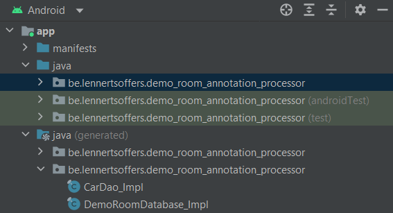

# Room’s annotation processing

Now we know how to set up a database with Room, let's take a look at what room does with our code behind the scenes.

In Android Studio, you can find the generated files in the Java generated package. Here we can see that Room generated a database implementation and a dao implementation for our car dao.



## Dao implementations

Depending on the annotations used in our dao interface, room generates different implementations. As you can see in the following piece of code, the generated implementations of the dao implements the dao interface we manually created.

### Properties

Implementations of dao’s always have a composition relationship with a RoomDatabase. The other properties of our implementations are dependent on the abstract methods we defined in our dao interface.

First of all, remember we defined an insert method. Room consequently generated the typed property of ‘EntityInsertionAdapter’. EntityInsertionAdapters are children of ‘SharedSQLiteStatements, that provide an implementation to execute insert statements on the database.

After the insert, we defined a delete query method. Queries are just treated as SQL statements and don’t have a more specific implementation like our insert statement.

We also defined a ‘findAll’ query, which is not translated in a ‘SharedSQLiteStatement’. This is because this query is directly built in the implementation of the ‘findAll’ method and is directly executed on the RoomDatabase.

```java
public final class CarDao_Impl implements CarDao {
private final RoomDatabase __db;
private final EntityInsertionAdapter<Car> __insertionAdapterOfCar;
private final SharedSQLiteStatement __preparedStmtOfDelete;
…
}
```

### Constructor

The constructor takes a ‘RoomDatabase’ as an argument and sets the RoomDatabase property of the dao. But more interestingly, the constructor also gives an implementation to our two SharedSQLiteStatements.

First, the implementation of the ‘EntityInsertionAdapter’ overrides the ‘createQuery’ and the ‘bind’ methods. The ‘createQuery’ just returns an insert SQL statement containing all the fields which were not annotated with `@Ignored` of the entity. The values are represented as ‘?’. This is because the values that are to be inserted are bound to this statement to prevent SQL injection.

This binding is precisely what the implementation of the ‘bind’ method does. It takes the statement of the ‘createQuery’ method and binds the values of the provided entity instance to the query. The binding makes use of the getters of the entity class. If the getter returns null, it binds null to the statement. If the getter returns a value, it binds this value to the correct spot in the statement.

The value of the second ‘SharedSQLiteStatement’ for the deletion of entities is easier. A delete statement doesn’t need an overridden implementation for the ‘bind’ method because its binding just uses the id of the entity. Only the ‘createQuery’ method is overridden to return the SQL statement we provided in the `@Query` annotation. Note that the parameter ‘:itemId’ is replaced with a ‘?’ for the same reason as preventing SQL injection. We’ll see a bit later where the id gets bound to the SQL statement.

```java
public CarDao_Impl(RoomDatabase __db) {
 this.__db = __db;

 this.__insertionAdapterOfCar = new EntityInsertionAdapter<Car>(__db) {
   @Override
   public String createQuery() {
     return "INSERT OR ABORT INTO `car` (`id`,`make`,`model`,`price`) VALUES (nullif(?, 0),?,?,?)";
   }

   @Override
   public void bind(SupportSQLiteStatement stmt, Car value) {
     stmt.bindLong(1, value.getId());
     if (value.getMake() == null) {
       stmt.bindNull(2);
     } else {
       stmt.bindString(2, value.getMake());
     }
     if (value.getModel() == null) {
       stmt.bindNull(3);
     } else {
       stmt.bindString(3, value.getModel());
     }
     stmt.bindDouble(4, value.getPrice());
   }
 };

 this.__preparedStmtOfDelete = new SharedSQLiteStatement(__db) {
   @Override
   public String createQuery() {
     final String _query = "DELETE FROM car WHERE id = ?";
     return _query;
   }
 };
}
```

### Insert method

The implementation of the ‘insert’ method makes use of the specification of the ‘EntityInsertionAdapter’ that provides ‘insertAndReturnId’. This method will insert the passed entity in the database and return the id of the row on which this entity was inserted. It’s also important to note that this query is wrapped within a transaction to provide safe rollback functionality.

```java
@Override
public long insert(final Car item) {
 __db.assertNotSuspendingTransaction();
 __db.beginTransaction();
 try {
   long _result = __insertionAdapterOfCar.insertAndReturnId(item);
   __db.setTransactionSuccessful();
   return _result;
 } finally {
   __db.endTransaction();
 }
}
```

### Delete method

The implementation of the ‘delete’ method starts with acquiring the SQL statement for the deletion of entities in this table. As mentioned before, there is no method to bind data to this statement in the ‘SharedSQLiteStatement’ class. That is the use of the next two lines in the code. There is only one parameter and the index of this parameter is 1. Then, the value is bound to the statement on this index. After the binding, the statement is executed (also wrapped in a transaction).

```java
@Override
public void delete(final int itemId) {
 __db.assertNotSuspendingTransaction();
 final SupportSQLiteStatement _stmt = __preparedStmtOfDelete.acquire();
 int _argIndex = 1;
 _stmt.bindLong(_argIndex, itemId);
 __db.beginTransaction();
 try {
   _stmt.executeUpdateDelete();
   __db.setTransactionSuccessful();
 } finally {
   __db.endTransaction();
   __preparedStmtOfDelete.release(_stmt);
 }
}
```

### findAll method

The ‘findAll’ method starts with defining the SQL statement that should be executed on the database. Then this string gets converted into a real RoomSQLiteQuery with a certain amount of arguments. After acquiring the query, the query gets executed on the database. This query will return a cursor instance.

The only thing that is left to do is creating a list of entity instances from the rows in the cursor. For each field of the entity class, the column id in the cursor must be obtained. Now the cursor is iterated and for each row, a new instance is created. The values of the entity are set to the values in the cursor by getting the value based on the index of this field. If the column for that field is empty, the field in the entity gets set to null. This entity instance then gets added to the list of returned entities. Finally, the list of objects is returned.

```java
@Override
public List<Car> findAll() {
 final String _sql = "SELECT * from car";
 final RoomSQLiteQuery _statement = RoomSQLiteQuery.acquire(_sql, 0);
 __db.assertNotSuspendingTransaction();
 final Cursor _cursor = DBUtil.query(__db, _statement, false, null);
 try {
   final int _cursorIndexOfId = CursorUtil.getColumnIndexOrThrow(_cursor, "id");
   final int _cursorIndexOfMake = CursorUtil.getColumnIndexOrThrow(_cursor, "make");
   final int _cursorIndexOfModel = CursorUtil.getColumnIndexOrThrow(_cursor, "model");
   final int _cursorIndexOfPrice = CursorUtil.getColumnIndexOrThrow(_cursor, "price");
   final List<Car> _result = new ArrayList<Car>(_cursor.getCount());
   while(_cursor.moveToNext()) {
     final Car _item;
     _item = new Car();
     final int _tmpId;
     _tmpId = _cursor.getInt(_cursorIndexOfId);
     _item.setId(_tmpId);
     final String _tmpMake;
     if (_cursor.isNull(_cursorIndexOfMake)) {
       _tmpMake = null;
     } else {
       _tmpMake = _cursor.getString(_cursorIndexOfMake);
     }
     _item.setMake(_tmpMake);
     final String _tmpModel;
     if (_cursor.isNull(_cursorIndexOfModel)) {
       _tmpModel = null;
     } else {
       _tmpModel = _cursor.getString(_cursorIndexOfModel);
     }
     _item.setModel(_tmpModel);
     final double _tmpPrice;
     _tmpPrice = _cursor.getDouble(_cursorIndexOfPrice);
     _item.setPrice(_tmpPrice);
     _result.add(_item);
   }
   return _result;
 } finally {
   _cursor.close();
   _statement.release();
 }
}
```

## Database Implementation

Room generates one implementation for our previously defined abstract database class. It has private volatile properties for all dao’s we defined. It also generates an implementation for the getter methods that get the dao’s in the application. The getter creates a new dao instance if no instance of the dao exists, or returns the dao instance of the database if it was previously created.

```java
public final class DemoRoomDatabase_Impl extends DemoRoomDatabase {
 private volatile CarDao _carDao;

@Override
public CarDao carDao() {
 if (_carDao != null) {
   return _carDao;
 } else {
   synchronized(this) {
     if(_carDao == null) {
       _carDao = new CarDao_Impl(this);
     }
     return _carDao;
   }
 }
}
}
```

The generated implementation also overrides the ‘createOpenHelper’ method. This method returns a ‘SupportSQLiteOpenHelper’ instance of which the configuration is also created here. The most interesting part of the ‘SupportSQLiteOpenHelper’ is the callback that gets set in the configuration. The callback contains a ‘RoomOpenHelper.Delegate’ (piece of code that is run when the callback is called).

In this delegate you can find the ‘createAllTables’ and ‘dropAllTables’ methods. In the ‘createAllTables’, you can see that Room generated the SQL statements to create all tables.

```java
@Override
public void createAllTables(SupportSQLiteDatabase _db) {
 _db.execSQL("CREATE TABLE IF NOT EXISTS `car` (`id` INTEGER PRIMARY KEY AUTOINCREMENT NOT NULL, `make` TEXT, `model` TEXT, `price` REAL NOT NULL)");
…
}
```

In the ‘dropAllTables’, room generated the SQL statements to drop all the tables of the entities.

```java
@Override
public void dropAllTables(SupportSQLiteDatabase _db) {
 _db.execSQL("DROP TABLE IF EXISTS `car`");
}
```


[< BACK](./The%20magic%20of%20Room's%20annotation%20processor.md)